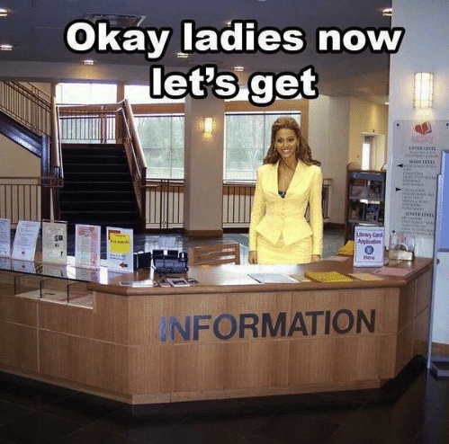
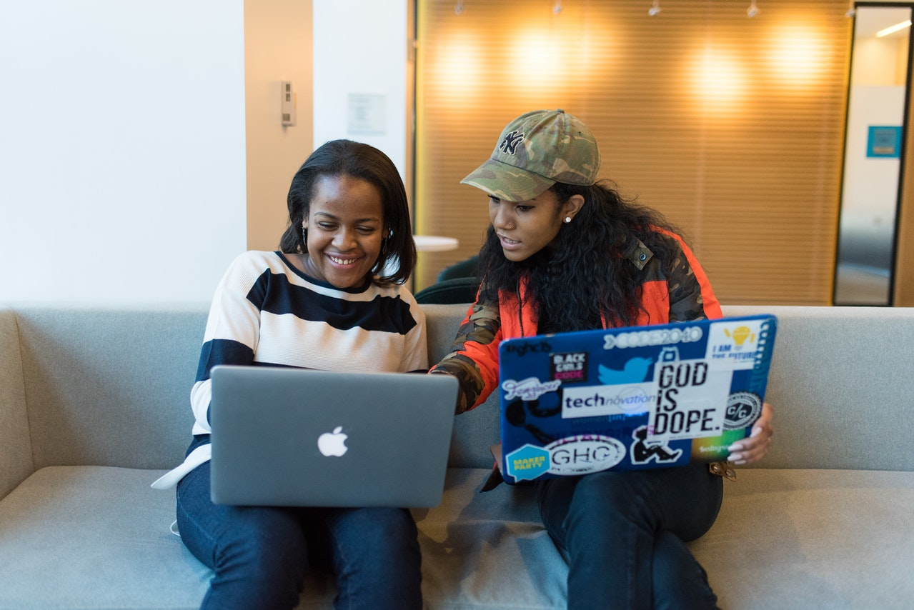

+++
title = "Comprehensive advice to get your first dev job"
date = 2021-10-16
header_image = "https://images.ctfassets.net/jpqeq5qzj2oc/400WAhk9JvERwbFEQ9PMhh/a7916a403af451269032fb47700f7136/you-will-solve-that-leetcode-easy-today.jpeg"
+++

After you complete college, bootcamp, or self-training, it can be really hard to try to get your first junior role in tech. In the last 2 years, I’ve talked to so many friends and family about this very challenging process, and recently thought I should share this with a larger audience. I’m no expert, yadayada, but these tips were really helpful for me, so I decided to put together a comprehensive guide to job searching.

Also, I know this post is massive, I plan to treat it like software and keep iterating/breaking stuff out as needed. So if you see something change, mind ya business.

## Big summary

1\. **It’s really hard to break into tech. It’s not in your head.** Like any other hard thing, it takes effort; I’ll share some ways to channel this effort, in order to work smarter and make the process less excruciating.

2\. Unlike many other hard things, **you don’t just get out what you put in**. Studying hard and having an excellent interview are not a guarantee of a job, because it’s a zero-sum game: if an employer has two stellar candidates and one job posting, they are going to reject a stellar candidate, unfortunately. In a job search, you may do your absolute best and be a stellar candidate, but not get the outcome that you want.

3\. As a result, **your best bet is numbers**. The goal is to be a stellar candidate not at the scale of that one job, but for 3, 5, 10 jobs, more or less at the same time. When you advance in a process, awesome! Use that mood boost to go home and apply to more jobs. You always want to have multiple options.

So how do you get to the position of having more options?

## 1\. Research

Information will serve as the backbone of your job search. A good understanding of the market, of the companies you're interested in, and of how you stack up as a candidate will serve as the foundation for the rest of your efforts.

### 1.1 What does the market look like?

Hopefully, you know at least one trustworthy expert on the state of the market. They should be able to tell you about compensation, major trends, where to focus your energy, and maybe even some key companies to keep track of. My trustworthy expert was my career coach at the bootcamp I attended, Trent Rhodes; if you don’t have that person, there are some great people publicly doing analysis on the market and providing insights, like [Gergely Orosz](https://blog.pragmaticengineer.com/). With blogs, it can be hard to discern the real from the click-baity, but it’s good to find at least one person who has a holistic view of the market.

### 1.2 What companies am I interested in? What’s the inside scoop?

You may already have a list of “dream companies” — or even a list of companies you know pay well. If you don’t have insight into compensation, [levels.fyi](https://levels.fyi) is a great resource, or [this article](https://blog.pragmaticengineer.com/software-engineering-salaries-in-the-netherlands-and-europe/) in the EU was super insightful for me. Researching sites and reading articles will likely uncover some more names of interest.

That being said, especially if you’re underrepresented, it’s risky to just trust the image a company presents on its careers page. You could end up at a place that looks shiny from the outside, and maybe even treats most privileged employees well, but could hide a terrible reality. For the inside scoop, I’d strongly recommend reaching out to people at your “dream companies,” especially people who share certain identities with you. These people are best-placed to explain the hiring processes and standards of their employer, and give you some feedback, which brings me to my next point of research…

### 1.3 How does someone like me stack up?

You can have some idea of what the market looks like, but especially as a junior, it’s really hard to understand how you stack up in relation to the company and to the competition. Feedback from a trusted person, on your skills, your resume, and your portfolio, are super important. I wouldn’t suggest getting feedback from too many people, as that can be overwhelming and actually hurt your confidence, but 2-4 people whose judgment you trust should give you very helpful advice.

Here are some examples:

*   I got a portfolio review from a software engineer on Discord that I’d met on Reddit. One of the commenters in the channel was rude, but the reviewer was very encouraging and gave me specific feedback that I directly implemented.
    
*   I did mock interviews on [pramp.com](https://www.pramp.com/)
    
*   I also did one real interview where I bombed so hard that I just requested feedback mid-way, and the interviewer very kindly told me where I needed to improve.
    

Overall, I’d suggest to keep an open mind — meaning, be open to criticism, and potentially even harder, be open to praise and encouragement!

## 2\. Organization

To have a successful job search, rhythm is crucial; since it's likely going to be a marathon and not a sprint. In order to keep your energy constant, some structure will likely be very helpful. I have ADHD, I don’t like strict routines and usually don’t follow them well; but I built myself a schedule that was tailor-made for my needs, which enabled me to stick to it every day for 4 months.

### 2.1 Location

Location is pretty important. Now that my home is actually set up to have a separate office area, I might feel differently than back when I was in a shared 1-bedroom, but for me, it was crucial to get out of the house to work on my job search. I alternated between the public library and my then-partner’s grad student lounge, where we worked together. This had two effects: at the library, I knew I was there for business, and so home could feel like a safe haven, where I didn’t have to think – or feel guilty about – job applications.

### 2.2 Schedule breakdown

I had a set schedule during my job search. I worked 10am-5pm, Monday to Friday. Mornings, until 1pm, were for “internal-facing stuff”, then I had a lunch break, and evenings from 2pm to 5pm were for “external-facing stuff.”

#### Internal-facing stuff

Internal-facing stuff is what I call anything that’s meant to make you a better candidate, especially technical work. It can include, for example, building projects, practicing coding challenges, data structures and algorithms, reading books, watching tech talks. I didn’t have specific goals for this, so if I was getting super tired of leetcode, I could work on a project, or procrastinate by reading Python blog posts.

#### External-facing stuff

External-facing stuff is what I call anything related to progress in your job process. Job applications, coffee chats, researching companies, practicing interviewing questions and elevator pitches. **For this, I had an extremely important goal: I had to send at least one application per day.** Even if it was a LinkedIn auto apply that took 2 seconds, for a posting I didn’t care about, and was certain I wouldn’t get, I had to do it before I went home. Otherwise, one day goes by, then two, then fifteen, and then it’s been a month since you’ve applied to a job, and you feel like crap, and you’re equally angry at the world and at yourself.

I’m going to emphasize, again, that it’s super tempting to skip the external-facing stuff when you don’t feel ready, but it's **necessary**. I had a couple of weeks where I didn’t want to submit anything because my portfolio site wasn’t complete. Trent practically had to shake me! He told me something along the lines of: “you’re never going to feel ready. It’s useless to spend 3 days on that cover letter that no one’s going to read, spend 3 days applying to 30 jobs instead.” Trent was ruthless (but right.)

### 2.3 Tracking

Tracking is important, first, for organization, but also, for documentation, so that you have a clear way to track your progress (super useful on those days where you feel like things aren't moving). I used this to confirm that my interviews started picking up basically as soon as I started applying to 3 or more jobs per day (Trent, you win again). If the goal is to have several jobs in the pipeline at all times, it can be hard to track, especially if you take into account those linkedin auto applies that took 2.5 seconds ;). I used Asana at the time, but nowadays I use Airtable for all things organizing. Here’s a [link to an airtable template I built](https://airtable.com/shr9sMSvwPQHC7Huu) that does pretty much the same thing as I did in my Asana.

## 3. Networking

### 3.1 Why (dear god why)

As you've probably experienced, there are few jobs for juniors, and you can apply to so many jobs online and never hear back. That’s super real. It’s usually because, at the junior level, you are not as specialized as later in your career, so almost everyone is applying to the very same kinds of postings. In addition, while mid-level employees can change jobs every few years and be selective, all juniors are in a time crunch. As a result, for each posting you apply to, there are dozens of other resumes, 2 of whom are from the CTO’s nephew’s college friends. You can still make it — thousands do every year — but that requires competing with those who have an in.

And yes, that means networking.

There’s a misconception that networking is purely superficial. As an introvert, I like deep connections, and feel terrible about transactional “I scratch my back, you scratch yours” relationships. I’ve found that networking does not have to be transactional; in fact, I’ve met people that I’ve had in my professional life long-term and even people who became good friends.

It's true that while job searching, it can feel like you’re begging, which makes it more socially stressful. I’ve found it useful to keep in mind that just because a relationship involves a transaction at one point, doesn’t mean it’s transactional. You can get referred to a job and also be friends with the referrer for years afterwards, where the referral was just a starting point. If what you want is to build real friendships with people you genuinely like, then you can and will have that.

### 3.2 How to find people

There are 4 broad categories I’ll cover, and I’ll go from least targeted to most targeted, more or less.

#### Online communities

First, organizations and online communities. I’m very active on twitter now, but during my job search I was actually way more active in meetups and slack communities. They were a great support system, a way to nerd out about specific subjects (you can even do hackathons!), and surprisingly, a way to contribute and feel useful! Here are a few I am/was a part of: - We Build Black - League of Women Coders - my bootcamp’s alum slack - recently, SheSharp NL … I feel like there were more, but once I got busy with my job, the amount of communities I participate in got narrower. The above are the ones I had the most connections with, I made friends, mentors, and even mentees later on!

#### Conferences

Then, there are tech conferences and meetup events, which are one of the best ways to generate job leads. I think it’s a great starting point when you’re socially anxious, because you can step out when needed, and the interactions tend to be short. Here are some examples: - BITCON (international) - Grace Hopper Conference (there’s an EMEA and a US version) - AfroTech (US) - Lesbians Who Tech Summit

I usually stay aware of tech conferences with the [SeeCFP](https://seecfp.com/) mailing list (which sends conference that are currently accepting proposals), it’s not complete but useful.

#### Company events

Thirdly, a less-known avenue is company events. Many large companies have an event webpage keeping you up to date with external-facing stuff they’re participating in, or even events they’re hosting themselves. Those tend to have recruiters present, and you also get to learn about real challenges the company may have solved; maybe even meet potential coworkers. I find those super gratifying, because they feel genuine and professional.

#### Direct reachouts

Finally, there is the direct reachout, which I did almost exclusively on Linkedin. My approach is to add a large number of people who I think are cool or work at an interesting company. Then, when I already had a role in mind, I’d message them and try to set up a coffee chat.

I’d say that while conferences are a broad net with superficial interactions, Linkedin is a very narrow and deep interaction, in that people will usually be able to give you very specific, targeted help, or point you to someone who can.

In sum, all these approaches have great potential and drawbacks. I recommend a combination of all, especially as you figure out what you enjoy, don’t enjoy, and what your social limits are.

### 3.3 What to say

If, like me, you have social anxiety, you may find it useful to have an idea of the social expectations for this kind of reachout. For Linkedin, I've attached some examples of messages I’ve sent and received in the “I’d like to know more about your company because I want to work there, can we have a coffee chat?” scenario.

This one I sent to a super kind stranger, who ended up taking me on a tour of her office and bought me lunch:

I received this one in the last year, and ended up talking to the person on the phone for around 2 hours:

Now, once you meet with a person one-on-one, it’s not super complicated. You have a few things you want to hit:

1.  introduce yourself and your goals. This is harder than it sounds, so I recommend practicing it a bunch to come up with an enthusiastic, concise (<20 seconds), and factual introduction.
    
2.  Ask questions. It’s good to connect with the person as a potential friend, and also to ask the questions that only this person can answer. You’ll make a great impression if you have done research, i.e. “I read that Disney Streaming acquired Hulu, has that affected your work?”
    
3.  Close: if it’s a conference or other event, ask if they have roles you could apply to. If it’s at the end of a coffee chat, ask if they’d be comfortable giving you a referral. Seriously, the worst thing they can say is no, and if so, they’ll usually give good reasons. Plus, most tech companies actually have incentives for the employee (mine gives me a $3000 bonus if I refer someone who is hired in a technical role), so it could benefit them too.
    

That’s the basic playbook. Later on, just keep in mind that if the person chatted with you, especially a coffee chat, it’s because they care. Most would love to stay in touch, and an update, even if it’s “I wasn’t chosen but I appreciate your help, thanks again!” helps you confirm you weren’t just using this person, and you actually care too.

## 4\. Mental work

I’ve been hinting at this all throughout the post: I think the most underrated challenge during the job process is the mental energy it takes. This process can be super demoralizing and stressful, especially when you have financial pressures. I’ve had depression several times in my life, but I managed to keep my energy up throughout my 5-month search! Here are some things that kept me hopeful and healthy.

### 4.1 Keeping it rational

The research you do in section 1 is your foundation. With my research, I knew the context I was in and how I stacked up. As a result, even when I was down in the dumps, I understood rationally that on paper I was a good candidate, and I had the right expectations for my search. Silly thoughts like “maybe there’s just something invisible about me that’s deeply unhireable” were easier to chase away.

Side note - YMMV - to this day, one of the things I tell myself is “you’re not that special.” I know it sounds harsh! But personally, I find super empowering: what I mean by that is that given my skills, my education, and the feedback I get, there’s no particular reason why I would have super different results than anyone else in my situation. I’m not cursed. If someone with a similar profile to me can make it, I can too, with time. And if you don’t have that example to fall back to, go back to #1 or #3.

### 4.2 Remembering: “you don’t control the outcome, you only control the input.”

This was a really hard lesson to swallow, especially because my first job search out of college didn’t teach me that; I’d gotten lucky and got a job relatively quickly, and thought it was due to my hard work. It’s hard to accept that you don’t fully control whether or not you get a job.

Like I mentioned in the intro, unlike school, working hard and doing well does not mean you’re going to get the outcome you want. There are many factors that go into candidate selection, and your personal amazingness is only one of these factors.

One of my rejections illustrated that really well, so it's anecdote time.

By month 4 of my job search, I’d gotten to final interviews with 4 companies, and I'd gotten rejected each time. Each time, I’d gotten constructive feedback and improved my social and technical skills. Then, I had a final interview with a fifth company, and I absolutely killed it. I solved all the technical challenges, I asked all the questions, and made a great impression. When I walked out, I thought: “There's no way I could have done any better. Whether or not I get the job is out of my hands”.

A few days later, I heard back: due to business needs, they had hired someone with more experience. They told me that it was a tough decision because I was a great fit and had great skills at my level, but I was less confident in my answers than the other candidate because I was a junior, which they acknowledged was a catch-22. They wished me the best, and I genuinely felt good about it. Two weeks later, I had a similar experience where I did great -- in fact, a little less well -- , and this time I did get the job.

– This is why you always have to keep multiple jobs in the pipeline! –

Anyway, this mantra helped me focus on being the best candidate I could be and getting as many leads as possible, so I didn’t sweat each individual hiring decision.

### 4.3 Support system

This almost goes without saying: I wouldn’t have had a successful job search without the support of my village, which included my friends, my sister, my then-partner, my dad, and my career coach, as well my bootcamp cohort (though it was hard not to compare myself to them when I was one of the last to get a job). They helped me take care of chores, heard me out when I needed to vent, and distracted me when I needed that too.

## Conclusion

Thanks for reading this far! To recap:

1.  Research and feedback are your foundation.
    
2.  Organization helps you have a steady rate of applications and interviews.
    
3.  Networking is crucial to get information, leads, and get your resume prioritized.
    
4.  Mental work is not to be underestimated: as long as you keep things rational and focus on what you’re putting in, you should be good.
    

Strong and steady wins the race! Good luck out there; and if you want to stay in touch, reach out on LinkedIn or Twitter.