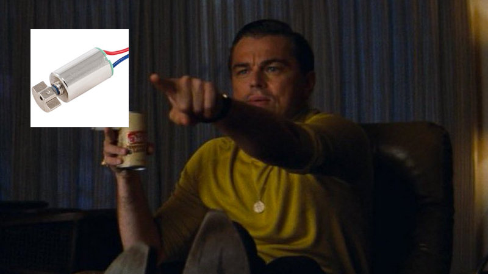

+++
title = "Vibro Zero"

[taxonomies]
tags = ["hardware"]

[extra]
header_image = "https://images.ctfassets.net/jpqeq5qzj2oc/4U1K3ZsJ5SmNPsDhcHsk9V/58c2d993db72076bc33b26660773b430/vibro_zero.png"
header_image_alt="A drawing of a purple blob with cutesy eyes and mouth, one black and one blue cable coming out of the top, marks indicating that it's moving, and the words Vibro Zero in black handwriting underneath"
date_built = 2022-03-31
date_approximate = false
+++

This project was built as part of the [Women Make challenge](https://womenmake.com/30-day-challenge/edition-4/projects)!

## The idea

If you've followed me on twitter a while, you may have seen this one twitter thread I had about vibrators, which, for better or for worse, didn't become a victim of my tweet-and-delete habit.

Long story short, one morning, I was using my vibrator and it died on me midway. Defeated, I plugged it in, and picked up my phone. Mindlessly scrolling through Twitter, I found out it was launch day for the brand new shiny iPhone 13! AirTags! New super-performant chip! Eleventy-lens camera! It all looked so fancy compared to the vibrator slowly charging on my nightstand, which for $80, couldn’t even vibrate while plugged in or indicate the battery level.

I made a random twitter shitpost about wanting someone to disrupt the vibrators industry, and right as I was about to delete, realized — actually, there’s no reason for me to delete this, because we’re not going to pretend we don’t use vibrators as 21st-century humans. And as it turns out, I have really amazing mutuals who shared many resources — special shout out to [@DawnWagesSays](https://twitter.com/dawnwagessays), who’s been particularly supportive. This turned into a real learning opportunity, and sparked an interest in hardware! After buying an arduino and learning a couple of basic projects, I stumbled upon the Women Make challenge. It was the perfect opportunity to build my first vibrator.

## The goal

Between March 1 and March 30, I would build a working circuit for a vibrator on my arduino. I decided would be an exposed circuit, because:

*   I'm using my Arduino Uno to learn multiple other things, so I'm not ready to use the circuit exclusively for this vibrator yet
    
*   I don't know how to build a case cheaply and easily
    
*   I think I'd have to solder things and I'm not ready for that either.
    

But what was clear was I'd want it to:

*   turn on and off
    
*   vibrate
    
*   have some cute lights
    
*   maybe some other fancy thing.
    

## The process

### Week 1

The first week, I clarified my requirements in my journal, and set up my plan. I also looked into components I'd have to buy on the internet, and got a little overwhelmed.

### Week 2

The second week, I took apart an older vibrator of mine. It wasn't working anymore, and I think it was related to the battery. I looked inside and realized the circuit was actually super simple-looking, almost flimsy. It was kind of like, all this huge case just for that one little circuit and motor, and two little buttons? It made me confident I could, one day, build something like this.

### Week 3

The third week, I headed to Berlin for a [SxTech EU](https://sxtech.eu/) meetup. I'd bought the ticket months before, but it kind of fell on the perfect weekend. There was one presentation on a new kind of vibrating motor, and when I saw pictures of DC motors, I was like "I know this guy!"

I also got to talk to a lot of chill people, and everyone was excited for my little project, which really encouraged me.

### Week 4

Like any good procrastinator, this is the week that I actually put everything together. I had the salvaged motor, which I kept in the silicone case that used to be the tip of the vibrating wand, and my arduino kit. In a couple of hours, I put together a circuit and a program that built on Projects 1, 2 and 3 of the beginner handbook, as well as a couple of things from the internet. And there it was! My own little circuit that came out of my brain.

## The result

Watch a [demo video here](https://twitter.com/zerornella/status/1508934435512672257?s=20&t=nw42zpYhhB7yR1Q2emMFzQ).

[Gist of my ugly code:](https://gist.github.com/0rnella/5986024f1f106f511e75e3c57328ba95) {{ gist(url="https://gist.github.com/0rnella/5986024f1f106f511e75e3c57328ba95") }}

## What's next

There's a lot I'd like to explore next, but more specifically:

**Vibration intensity:** I didn't get to play around with the intensity of the vibration. My initial idea was to do vibration intensity instead of pulsing, because pretty much nobody actually uses the pulsing modes, but I just didn't know how. I tried making the transistor's voltage value less than 153, but that didn't seem to work, it just wouldn't turn on at all.

**Smaller circuit:** this is such a simple circuit that I think I could reasonably buy a new, smaller microcontroller and try to make a smaller circuit that could reasonably fit in a vibrator. Might involve soldering though.

**Battery:** At the moment, this vibrator is powered by my computer. I'd like to use a battery, especially a rechargeable one, instead. A follow up would be the long-awaited battery level indicator, which I could implement with LEDs or, more high-tech, with the tiny screen that came with my arduino kit.

## PS

I’d like to thank the Women Make community for the motivation, and encourage you to go check out [all the amazing projects built this year!](https://womenmake.com/30-day-challenge/edition-4/projects)